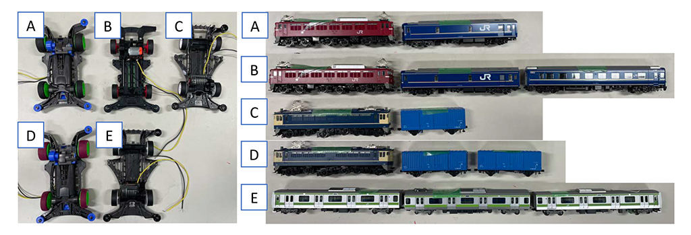
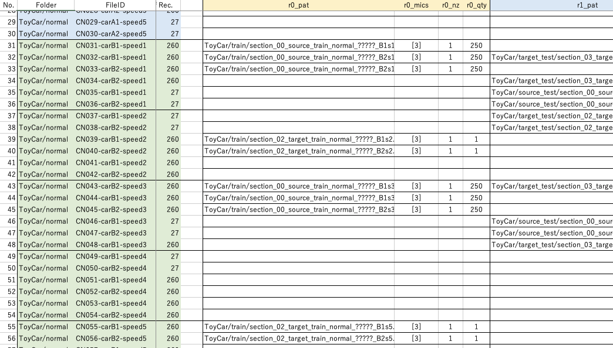

# ToyADMOS2: Another dataset of miniature-machine operating sounds for anomalous sound detection under domain shift conditions

This repository provides a data mixer tool for ToyADMOS2 🚗 🚃, a large-scale dataset for anomaly detection in machine operating sounds (ADMOS)
that consist of a large number of operating sounds of miniature machines (toys) under normal and anomaly conditions by deliberately damaging them.
You can find the detail of the dataset on the [ToyADMOS2 dataset](https://zenodo.org/record/4580270#.YLniqmb7RzU) website.

If you find the [ToyADMOS2](https://arxiv.org/abs/2106.02369) useful in your work, please consider citing [our paper](https://arxiv.org/abs/2106.02369).

```BibTeX
@inproceedings{harada2021toyadmos2,
    author = "Harada, Noboru and Niizumi, Daisuke and Takeuchi, Daiki and Ohishi, Yasunori and Yasuda, Masahiro and Saito, Shoichiro",
    title = "{ToyADMOS2}: Another Dataset of Miniature-Machine Operating Sounds for Anomalous Sound Detection under Domain Shift Conditions",
    booktitle = "Proceedings of the 6th Detection and Classification of Acoustic Scenes and Events 2021 Workshop (DCASE2021)",
    address = "Barcelona, Spain",
    month = "November",
    year = "2021",
    pages = "1--5",
    isbn = "978-84-09-36072-7",
    doi. = "10.5281/zenodo.5770113",
    _pdf = {https://dcase.community/documents/workshop2021/proceedings/DCASE2021Workshop_Harada_6.pdf}
}
```

## What is the ToyADMOS2 dataset?

ToyADMOS2 is a unique dataset, which we don't use as it is; it's a set of source material recording samples.
We then use a tool provided in this repository, and generate new datasets according to our new `recipes`.

The samples consist of the recordings under various conditions/configurations for normal/anomaly sounds. You can then edit/program your own set in the `recipe` so that you can compile new datasets for your research purposes.

__A document for how we made it [ToyADMOS2_details.pdf](ToyADMOS2_details.pdf) is also available.__
You can also check the detail of anomaly conditions with photos.

Please try making your own!

## Download dataset

Visit the [ToyADMOS2 dataset](https://zenodo.org/record/4580270#.YLniqmb7RzU) website hosted by http://zenodo.org/, and download.

### Wanna See the Miniature Machines?

Here're the videos of the toy car and the toy train:

- 🚗 [Click to play: ToyCarRun.mp4](https://user-images.githubusercontent.com/14831220/118355869-672e7680-b5ad-11eb-947d-e90b1bfeb7ed.mp4)
- 🚃 [Click to play: ToyTrainRun.mp4](https://user-images.githubusercontent.com/14831220/118355957-e0c66480-b5ad-11eb-950b-d874cfa0f0a8.mp4)

## Getting Started

Install dependent packages according to the `requirements.txt`.

This will install essential modules for running tools in this repository.

### Example: Making Example Dataset

Run the following will create the equivalent benchmark dataset evaluated in the Table 3 of the paper, which is a compatible file-folder structure with the [DCASE2021 challenge task 2](http://dcase.community/challenge2021/task-unsupervised-detection-of-anomalous-sounds). This will create dataset folder `your_new_dataset`. **This will take about an hour**.

```sh
# This creates `clean` dataset.
python mixer.py /path/to/ToyADMOS2 your_new_dataset recipe_benchmark.xlsx clean
# This creates SNR=6dB dataset.
python mixer.py /path/to/ToyADMOS2 your_new_dataset recipe_benchmark.xlsx 6
```

- `recipe_example_car_shift.xlsx` is also another example.
- `recipe_template` is a template, as well as one more example.

### Example: Running Baseline

1. Clone and apply a patch for making evaluation baseline based on [dcase2020_task2_baseline](https://github.com/y-kawagu/dcase2020_task2_baseline).

    ```sh
    git clone https://github.com/y-kawagu/dcase2020_task2_baseline
    cd dcase2020_task2_baseline && patch --binary < ../dcase2020_task2_baseline.patch
    ```

2. Make a symbolic link for the baseline that finds data source at `dcase2020_task2_baseline/dev_data`.

    ```sh
    cd dcase2020_task2_baseline && ln -s ../your_new_dataset dev_data
    ```

3. Run the baseline, then you can find the evaluation results stored in `result/result.csv`.

    ```sh
    cd dcase2020_task2_baseline
    python 00_train.py -d
    python 01_test.py -d
    ```

If you find anything missing when running `dcase2020_task2_baseline`, please follow the instruction in it to install basic modules.

## Making Your Dataset

(Example of a recipe file, yes it's an Excel spreadsheet.)



You simply make a copy of template ([recipe_template.xlsx](recipe_template.xlsx)), edit yours, then run a tool.

__You can find more information in the [UsersManual.md](UsersManual.md).__

## License

Please check the [LICENSE](LICENSE) for the detail.

## Acknowledgements

The evaluation of this dataset use [y-kawagu/dcase2020_task2_baseline](https://github.com/y-kawagu/dcase2020_task2_baseline). We thank [@y-kawagu](https://github.com/y-kawagu) for your dedication to the DCASE challenges!

This repository is an 2021 version, kudos to [@YumaKoizumi](https://github.com/YumaKoizumi/) for the 2020 efforts of the [ToyADMOS-dataset](https://github.com/YumaKoizumi/ToyADMOS-dataset).

## References

- [Noboru Harada, Daisuke Niizumi, Daiki Takeuchi, Yasunori Ohishi, Masahiro Yasuda, and Shoichiro Saito, "ToyADMOS2: Another dataset of miniature-machine operating sounds for anomalous sound detection under domain shift conditions," 2021](https://arxiv.org/abs/2106.02369)
- [Yuma Koizumi, Shoichiro Saito, Noboru Harada, Hisashi Uematsu and Keisuke Imoto, "ToyADMOS: A Dataset of Miniature-Machine Operating Sounds for Anomalous Sound Detection," WASPAA, 2019](https://arxiv.org/abs/1908.03299)
- [Ryo Tanabe, Harsh Purohit, Kota Dohi, Takashi Endo, Yuki Nikaido, Toshiki Nakamura, and Yohei Kawaguchi, "MIMII DUE: Sound Dataset for Malfunctioning Industrial Machine Investigation and Inspection with Domain Shifts due to Changes in Operational and Environmental Conditions," 2021](https://arxiv.org/abs/2105.02702)
- [DCASE 2020 Challenge Task 2 "Unsupervised Detection of Anomalous Sounds for Machine Condition Monitoring"](http://dcase.community/challenge2020/task-unsupervised-detection-of-anomalous-sounds)
    - Baseline system for DCASE 2020 Challenge Task 2 - [dcase2020_task2_baseline](https://github.com/y-kawagu/dcase2020_task2_baseline)
- [DCASE 2021 Challenge Task 2 "Unsupervised Anomalous Sound Detection for Machine Condition Monitoring under Domain Shifted Conditions"](http://dcase.community/challenge2021/task-unsupervised-detection-of-anomalous-sounds)
    - Autoencoder-based baseline system for DCASE2021 Challenge Task 2 - [dcase2021_task2_baseline_ae](https://github.com/y-kawagu/dcase2021_task2_baseline_ae)
    - MobileNetV2-based baseline system for DCASE2021 Challenge Task 2 - [dcase2021_task2_mobile_net_v2](https://github.com/y-kawagu/dcase2021_task2_baseline_mobile_net_v2)
