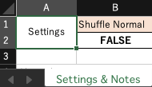
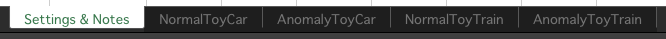
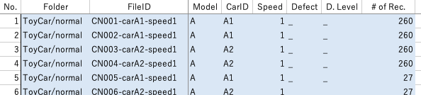
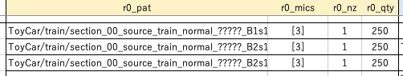
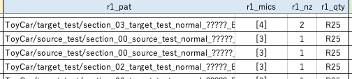
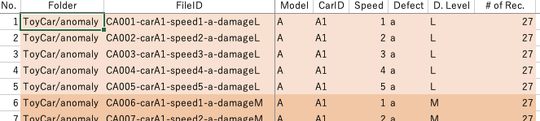
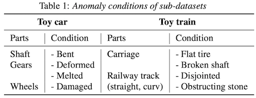
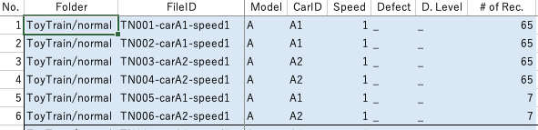
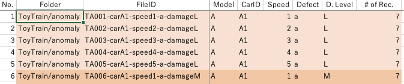

# ToyADMOS2 Dataset Users Manual

For making new dataset with your own configurations, make your recipe file, then run a mixer tool (a python script).

## 1. Mixer tool (mixer.py)

This tool mixes normal or anomaly samples with environmental noise samples at a specified SNR.

```sh
Usage: mix_dataset.py SRC_FOLDER DEST_FOLDER RECIPE_FILE SNR_DB
    SRC_FOLDER   Path to the ToyADMOS2 folder. 
    DEST_FOLDER  Path to a folder you want to create.
    RECIPE_FILE  Recipe file for describing the use of samples.
    SNR_DB       SNR in dB (-6, 6, or any integer), or `clean`.
```

One more option is written in recipe file:



If True, all the _source domain_ normal samples will be shuffled after mixing all samples.
This is for alleviating the data distribution problem that is seen when a dataset is composed of a small number of recordings
and the difference of the data distributions between training and test set is too large.

### 1-1. Example of Runs of Mixer Tool

This will create a clean dataset compatible with the paper benchmark, using source data files from a folder `ToyADMOS2`,
and storing the resulting files under a folder `paper_clean`. This doesn't mix environmental noises.

```sh
python mixer.py ToyADMOS2 paper_clean recipe_benchmark.xlsx clean
```

This will mix environmental noise at -6dB of the SNR.

```sh
python mixer.py ToyADMOS2 paper_clean recipe_benchmark.xlsx -6
```


## 2. Making Recipe

Which samples, for how much, with which noise, for what mics?
The recipe is for configuring these details, as an Excel spreadsheet.

### 2-1. Overview of the Recipe File

- Two machines: ToyCar and ToyTrain.
- Two types of recordings: Normal sounds and anomalous sounds.
    - Normal sounds are for training and test set, whereas anomalous sounds are for test set only.
    - Normal sounds have 150 recording patterns, whereas anomalous sounds have 300 patterns.
- A recipe file has five or more sheets: `Settings & Notes`, `NormalToyCar`, `AnomalyToyCar`, `NormalToyTrain`, and `AnomalyToyTrain`.
    - `Settings & Notes` is for writing settings and descriptions/notes of the recipe.
    - `NormalToyCar`, `AnomalyToyCar` are for configuring for toy car recordings.
    - `NormalToyTrain`, `AnomalyToyTrain` are for toy train recordings.

(You can find sheet tabs at the bottom of Excel app.)



### 2-2. `NormalToyCar`

In the `NormalXXX` sheets, we have 150 patterns each.



The information on the recording patterns is written in columns A-I.

- `No.` -- Recording pattern no.
- `Folder` -- Relative path in the ToyADMOS2 dataset.
- `FileID` -- Recording pattern ID.
- `Model` -- The `machine configuration` (A to E).
- `CarID` -- ID of machine hardware recorded (used in the recording work).
- `Speed` -- The `operating speed` (1 to 5), corresponding to the five voltage levels, 2.8, 3.1, 3.4, 3.7, and 4.0 V.
- `Defect` -- Not used for normal samples.
- `D. Level` -- The `damage level`, not used here.
- `# of Rec.` -- Number of recording samples per mic. i.e. There are actually 260 x 5 = 1,300 samples if this is 260.

You will write configuration requirements (`r# = requirement`) in columns named `r#_xxx` as follows:



- `r0_pat` -- Resulting pathname pattern. `ToyCar/train/section_00_source_train_normal_?????.wav` will create files starting from `section_00_source_train_normal_00001.wav` under a folder `ToyCar/train`.
- `r0_mics` -- ID of mics to be used. `[3]` uses samples from mic `3` only, or `[4, 5]` uses samples from two mics `4` and `5`.
- `r0_nz` -- ID of environmental noise to be mixed. A single number is accepted: 1 to 4.
- `r0_qty` -- Number of samples to create.

If you need two or more requirements with one recording, here you can write in `r1_xxx`, `r2_xxx`, or more requirement columns.



- `r1_pat` -- The same as `r0_pat`. `ToyCar/source_test/section_00_source_test_normal_?????.wav` will create files starting from `section_00_source_test_normal_00001.wav` under a folder `ToyCar/source_test`.
- `r1_mics` -- The same as `r0_mics`.
- `r1_nz` -- The same as `r0_nz`.
- `r1_qty` -- The same as `r0_qty`. Wait, what's the `R25`? `R` means _replacement_. So `R25` will always pick samples from the beginning. If you have `25` in `r0_qty` and `10` in `r1_qty`, the first 25 samples will be used for making files with the pattern `r0_xxx`, and the next 10 samples are for the patten `r1_xxx`.

### 2-3. `AnomalyToyCar`

In the `AnomalyXXX` sheets, we have 300 patterns each.



- `Defect` -- The `anomaly conditions` defined in the Table 1 on the paper.
- `D. Level` -- The `damage level`: High, mid, or low.
- `# of Rec.` -- The same as `NormalToyCar`, and all the recordings has 27 samples per mic. i.e. There are actually 27 x 5 = 135 samples if we use samples from all mics.



The usage of the requirements are the same with `NormalXXX` sheets.

### 2-4. `NormalToyTrain`



The number of mic is 8 for toy train.

- `# of Rec.` -- There are actually 65 x 8 = 260 samples if this is 65.

The toy train normal recordings have about 1/4 number of samples compared to toy car.

It is designed to use the samples from four mics as one set; mic `[1,2,3,4]` is the first set, and `[5,6,7,8]` is the second.

- `r#_mics` -- ID of mics: `[1,2,3,4]`, `[5,6,7,8]`, or any combination for your purpose. `[1,2,3,4,5,6,7,8]` will use all the mics.

### 2-5. `AnomalyToyTrain`



The same design with the `NormalToyTrain`.

- `# of Rec.` -- All the recordings has 7 samples per mic. i.e. There are actually 7 x 8 = 56 samples if we use samples from all mics.

### 2-6. Other Notes

- The normal or anomaly samples are used from the beginning of sorted order of list of files, whereas the environmental noise samples are randomly picked with replacement.
- Logs are created under the destination folder, `log-NormalToyCar.txt` for example.

(Example log)

```
2021-05-01 12:03 INFO CN031-carB1-speed1_mic3_00001.wav|0.0406 + N1_mic3_01595.wav|0.0657 -> section_00_source_train_normal_00001_B1s1.wav snr=0dB
2021-05-01 12:03 INFO CN031-carB1-speed1_mic3_00002.wav|0.0406 + N1_mic3_03383.wav|0.0630 -> section_00_source_train_normal_00002_B1s1.wav snr=0dB
2021-05-01 12:03 INFO CN031-carB1-speed1_mic3_00003.wav|0.0406 + N1_mic3_03129.wav|0.0638 -> section_00_source_train_normal_00003_B1s1.wav snr=0dB
2021-05-01 12:03 INFO CN031-carB1-speed1_mic3_00004.wav|0.0406 + N1_mic3_03383.wav|0.0630 -> section_00_source_train_normal_00004_B1s1.wav snr=0dB
2021-05-01 12:03 INFO CN031-carB1-speed1_mic3_00005.wav|0.0406 + N1_mic3_04219.wav|0.0744 -> section_00_source_train_normal_00005_B1s1.wav snr=0dB
2021-05-01 12:04 INFO CN031-carB1-speed1_mic3_00006.wav|0.0406 + N1_mic3_01770.wav|0.0197 -> section_00_source_train_normal_00006_B1s1.wav snr=0dB
```

This shows that normal samples used are starting from `CN031-carB1-speed1_mic3_00001.wav`, mixed with randomly picked noise like `N1_mic3_01595.wav`, and output to the `section_00_source_train_normal_00001_B1s1.wav` at 0dB of the SNR.

The numbers following filenames (`0.0406` for example) are the RMS amplitude;
- RMS amplitude of normal or anomolous sample is the average value among samples,
- whereas that of noise sample is calculated from the file.

